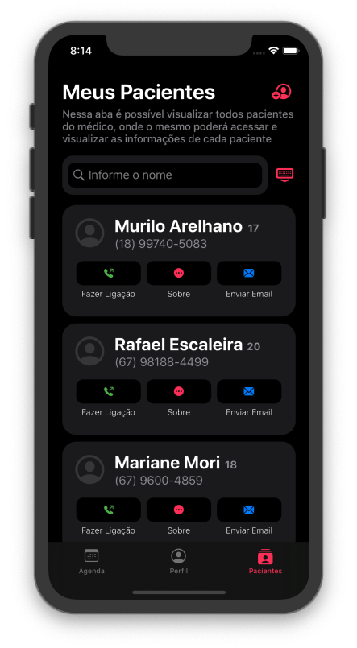

# 
 Help Your Health 

</a>

 Oferecer serviços de Integração de Informações Clínicas sobre o paciente com agilidade e baixo custo, agregando valor e inovação ao setor da saúde e respeitando a privacidade de nossos clientes, com intuito de agilizar consultas, organizar documentos e possibilitar a visualização dos mesmos pelos médicos sem necessidade de carregar tais documentos fisicamente. Criar prontuários que podem ser lidos por outros médicos para ajudar em diagnósticos e acompanhar informações mais atualizadas dos paciente. Acompanhar sintomas descritos pelos pacientes para observar os tratamentos, facilitando e agilizando o trabalho na área da saúde. 

<table style="width:80%">
  <tr>
    <th colspan="2">Screenshots</th>
  </tr>
  <tr>
    <td align="center">
      
      
<b>Portrait - Light Mode </b>

    </td>
    <td align="center">
      
      
<b>Portrait - Dark Mode </b>

    </td>
  </tr>
  <tr>
    <td align="center" colspan="2">
      
      
<b>Landscape - Light Mode </b>

    </td>
  </tr>
  <tr>
    <td align="center" colspan="2">
      
      
<b>Landscape - Dark Mode </b>

    </td>
  </tr>
  
  <tr>
    <td align="center">
      
      
<b>Portrait - Light Mode </b>

    </td>
    <td align="center">
      
      
<b>Portrait - Dark Mode </b>

    </td>
  </tr>
  <tr>
    <td align="center" colspan="2">
      
      
<b>Landscape - Light Mode </b>

    </td>
  </tr>
  <tr>
    <td align="center" colspan="2">
      
      
<b>Landscape - Dark Mode </b>

    </td>
  </tr>
</table>
